# Setup Steps
Please don't get worried about the number of steps listed here. We wanted to be as detailed as possible :)

1. Go to the [download page](https://github.com/FKLC/WhatsAppToDiscord/releases/latest) and download the version that is right for your computer.

  
Show photo

  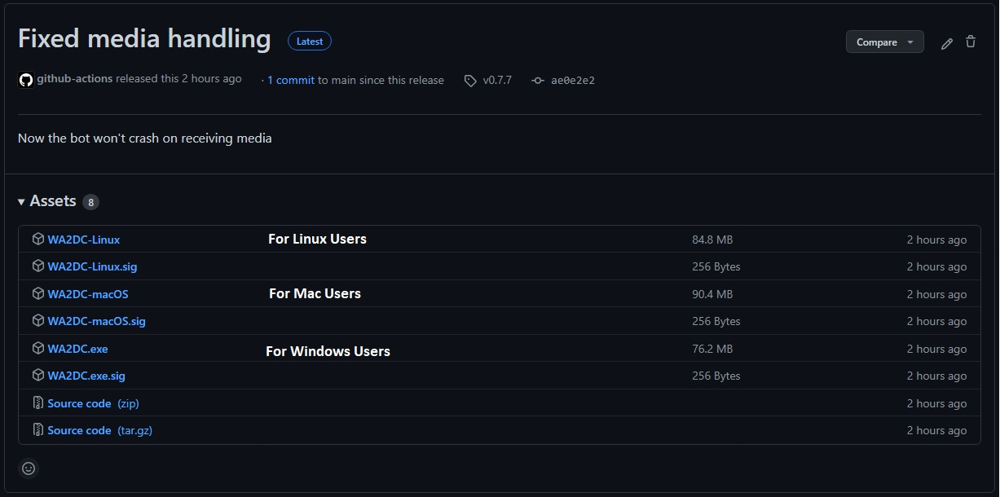

1. As the bot will create some files, create a new folder in a directory you wish to prevent cluttering. Then, move the downloaded file to that folder.

  
Show photo

  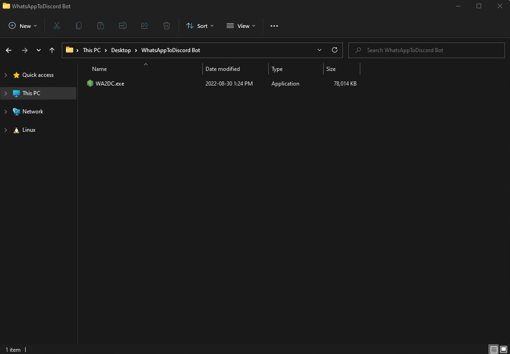

1. Go to [Discord Developer Portal](https://discord.com/developers/applications/), so that we can create a new bot.

  
Show photo

  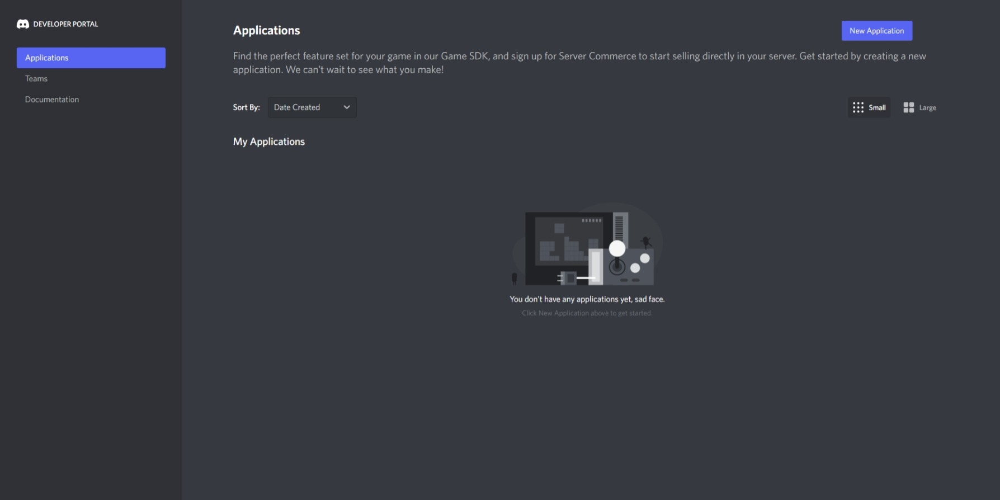

1. Click on the **blue button** on the right upper corner with the text *"New Application"*

  
Show photo

  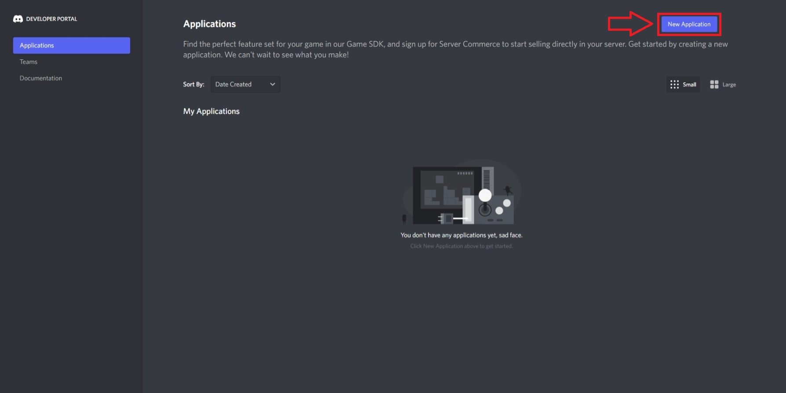

1. Give your bot a name, then click *"create"*.

  
Show photo

  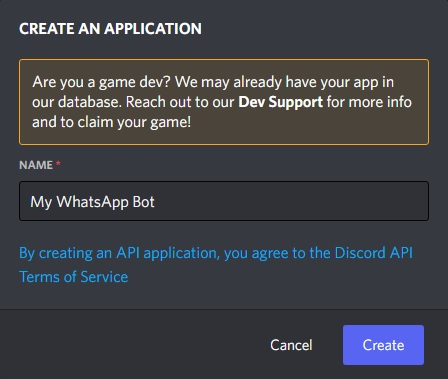

1. Move to *"Bot"* using the sidebar, then click on *"Add Bot"*, then click on *"Yes, do it!"*.

  
Show photo

  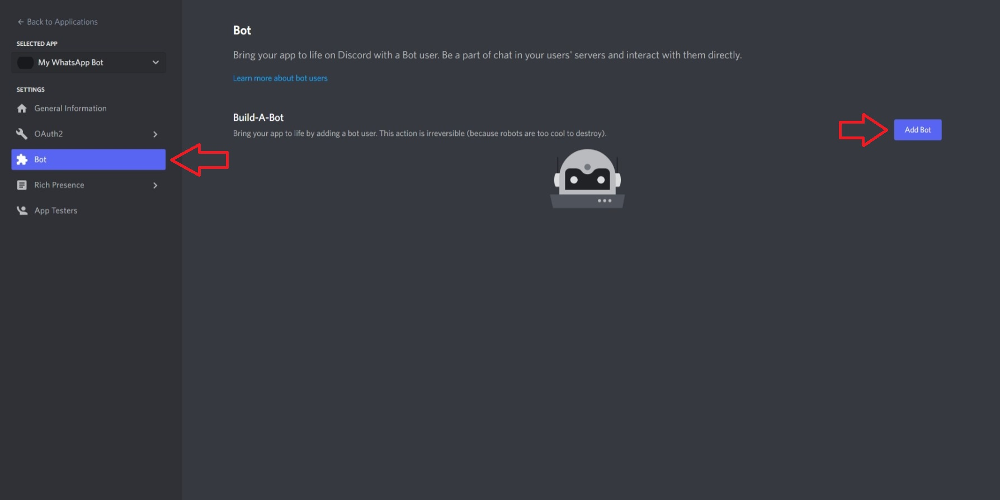
  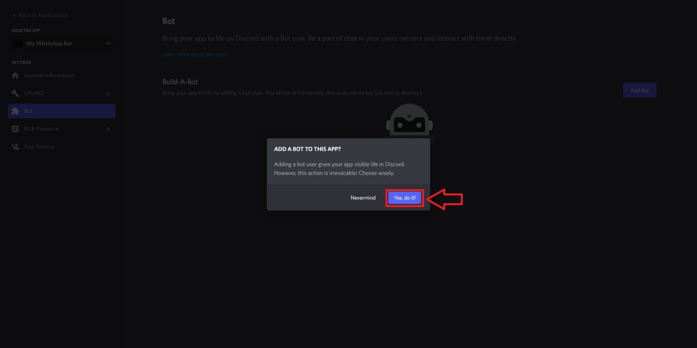

1. Click on *"Copy"* to copy your bot's token.

  
Show photo

  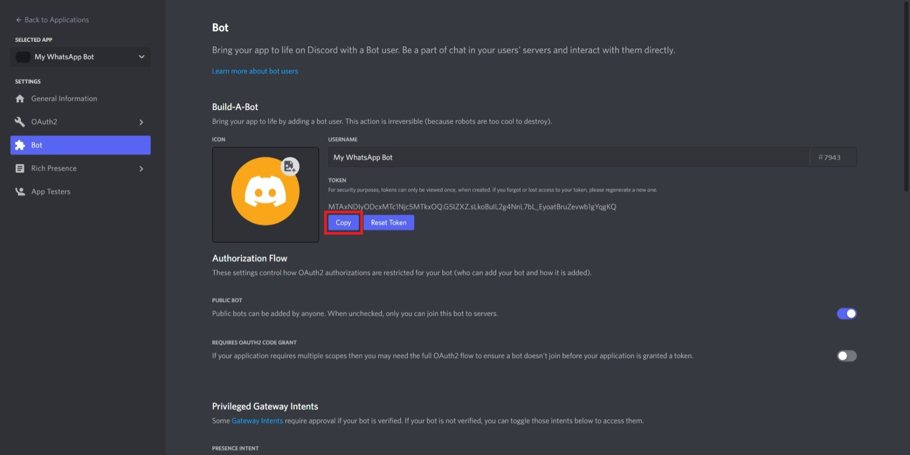

1. Then, scroll down and enable *"MESSAGE CONTENT INTENT"*

  
Show photo

  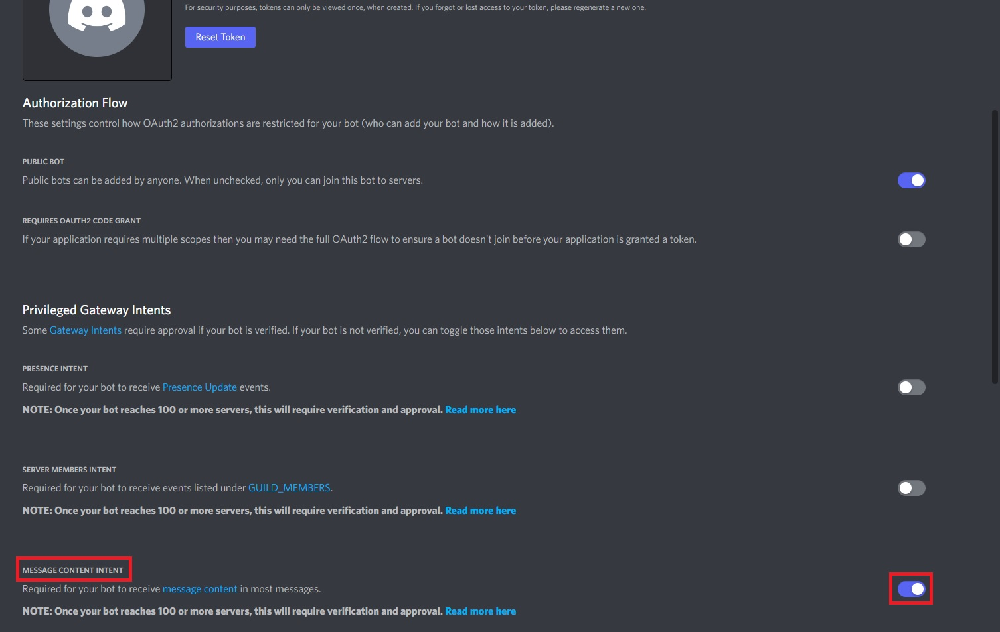

1. Now, go back to the file you downloaded, and run it! (Microsoft Defender SmartScreen may warn you about running the executable as this project is quite small and not well-known, but if you feel unsafe, you can always inspect and run the open source code from GitHub using Node. To skip SmartScreen, you can click on *"More Info"*, then *"Run"*)

  
Show photo

  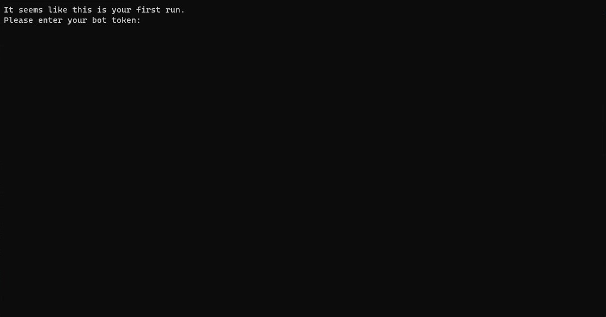

1. When asked, paste the bot token. You can do this by right-clicking. Then, hit enter.

  
Show photo

  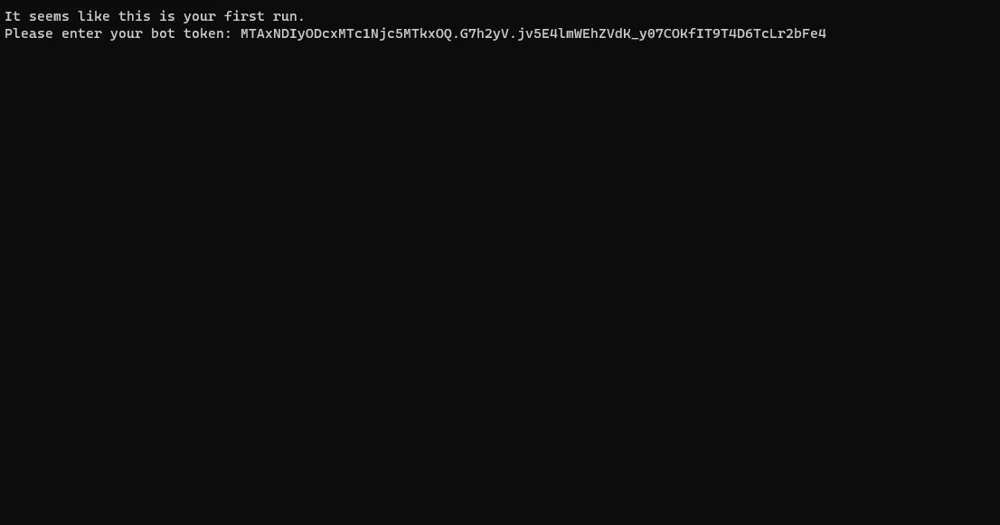

1. The bot will show its invitation link. Go to the link using your browser by copying and pasting the link. Select the server you want to use your WhatsApp from. Then, click *"Continue"*, and *"Authorize"*.

  
Show photo

  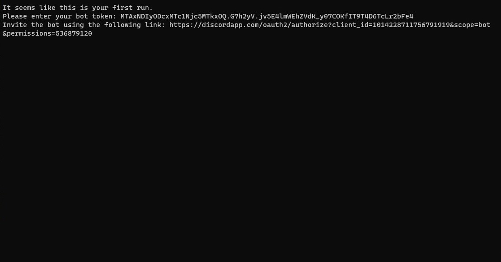
  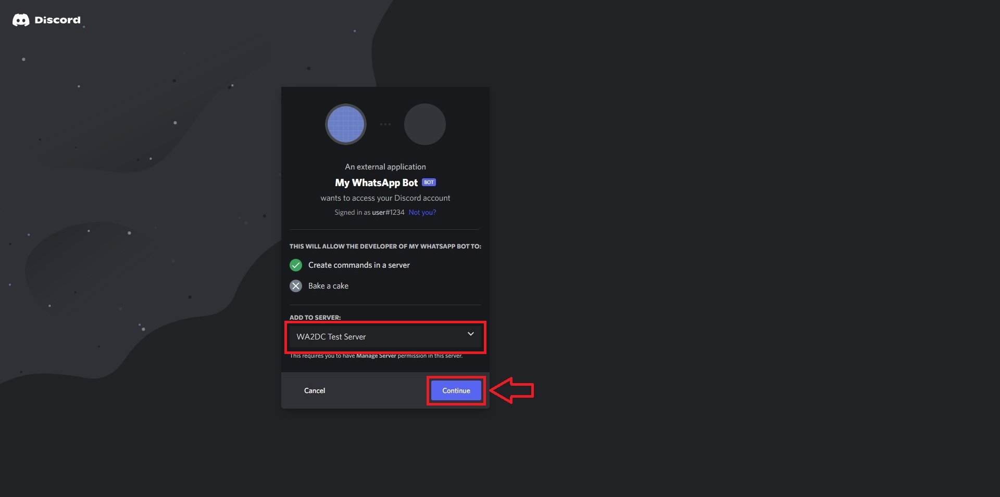

1. The bot will join the server and create some channels. Then, it'll send the WhatsApp Web QR code to the newly created `#control-room`.

  
Show photo

  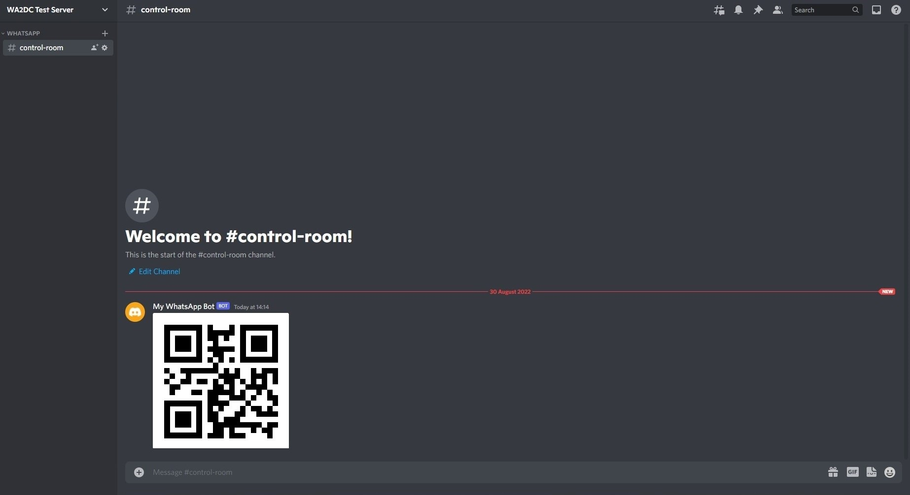

1. Then, just scan the QR code on your phone through WhatsApp. If you need help with that, check [WhatsApp's official help page](https://faq.whatsapp.com/539218963354346/?locale=en_US).
1. You are good to go! Now, you can explore [Commands](commands.md) to learn how to start conversations.